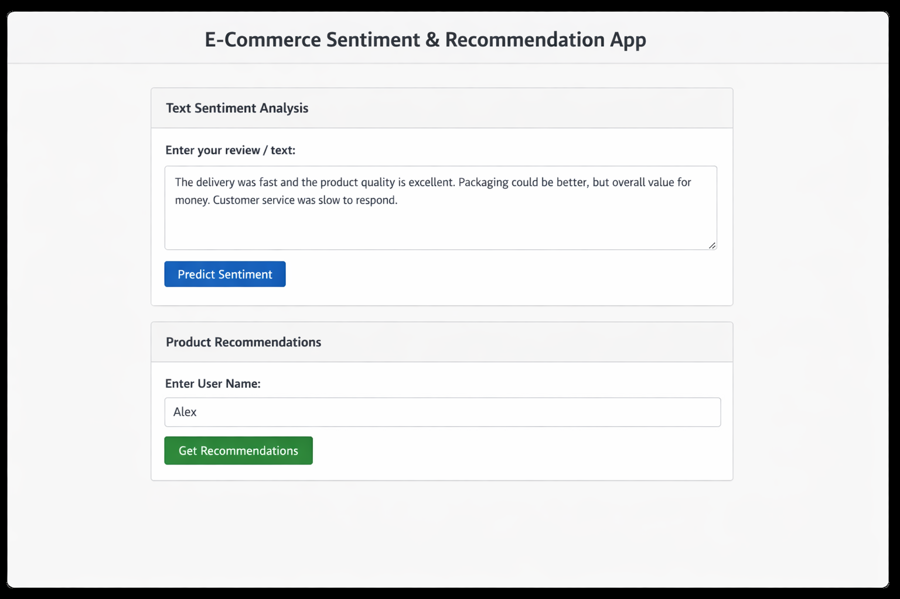
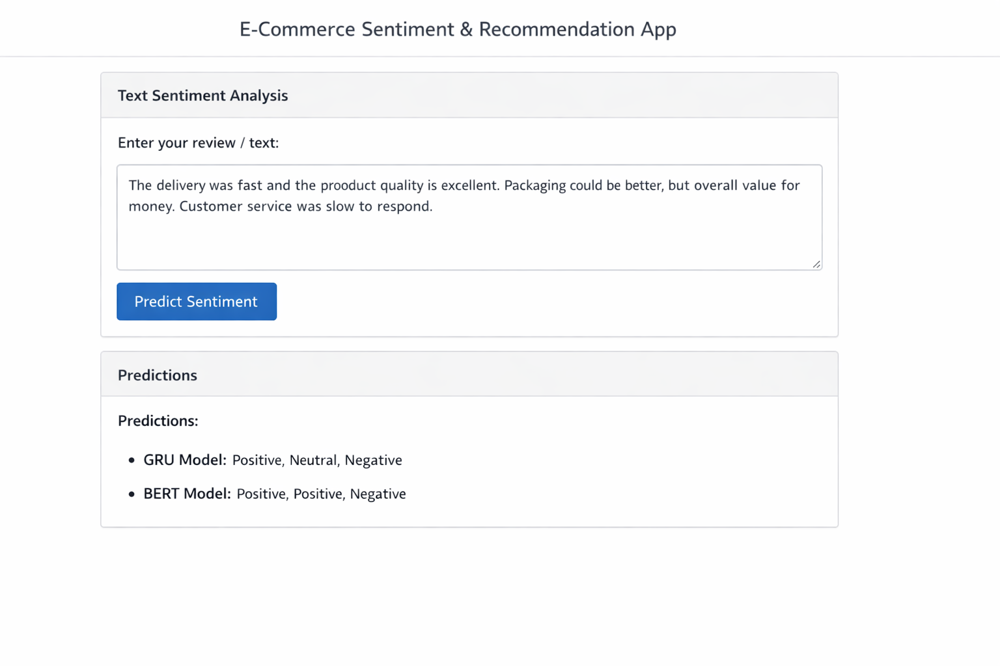
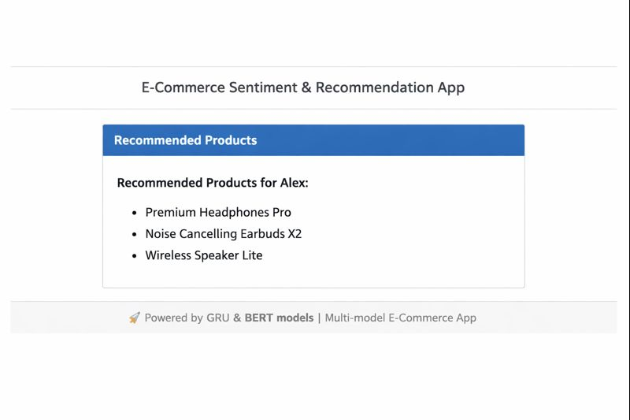

# 🛍️ E-Commerce Text Classification and Product Recommendation App

This project is a full-stack **Flask web application** that integrates **deep learning (GRU & BERT)** models for **text sentiment classification** and a **recommendation engine** for suggesting products based on user similarity.

It is designed for deployment on **Render** (Standard or higher plan).

---

## 🚀 Features

- 🧩 **GRU-based Sentiment Classifier**  
  A lightweight TensorFlow GRU model trained on e-commerce product reviews.

- 🤖 **BERT Fine-Tuned Model**  
  A Transformer model (`bert-base-uncased`) fine-tuned for text sentiment or feature extraction.

- 💡 **Product Recommendation Engine**  
  Collaborative filtering using user–product interaction matrix (cosine similarity).

- 🌐 **Flask REST API + Web UI**
  - `/predict/gru` → Predict sentiment using GRU model  
  - `/predict/bert` → Predict sentiment using BERT model  
  - `/recommend` → Recommend products for a given user  
  - `/status` → Health check (used by Render)

---

## 🧰 Tech Stack

| Component | Technology |
|------------|-------------|
| Backend | Flask (Python 3.12) |
| Models | TensorFlow GRU, Hugging Face BERT |
| Data | Pandas, Scikit-learn |
| Deployment | Render (Standard plan, 2 GB RAM) |
| Storage | Google Drive (model hosting via `gdown`) |

---

## 📦 Folder Structure

E_Commerce_project_text_classification/
│
├── app.py # Main Flask app

├── templates/
│ └── index.html # Web UI

├── DL_models/
│ ├── gru_model.keras # GRU model file (downloaded at runtime)
│ ├── metadata.json # GRU tokenizer + label encoder
│ ├── bert_finetuned/ # Fine-tuned BERT model directory
│ └── user_product_matrix.csv # User-item interaction data

├── requirements.txt   
├── render.yaml   
├── gunicorn.conf.py   
└── README.md

## 🧩 Render Deployment Guide

Push to GitHub
Go to Render.com
Create a new Web Service → Connect your GitHub repo.
In “Build Command”, use:
      pip install --upgrade pip && pip install -r requirements.txt
In “Start Command”, use:
      python app.py
Choose Standard Plan (2 GB RAM) or higher.
Deploy 🎉

## ⚡ API Endpoints

| Endpoint        | Method | Description                   |
| --------------- | ------ | ----------------------------- |
| `/predict/gru`  | POST   | Predict sentiment using GRU   |
| `/predict/bert` | POST   | Predict sentiment using BERT  |
| `/recommend`    | POST   | Recommend products for a user |
| `/status`       | GET    | Health and service info       |

## 🧩 Example Request (JSON)

{
  "user_name": "Alex",
  "reviews": [
    "The delivery was fast and the product quality is excellent.",
    "Packaging could be better, but overall value for money.",
    "Customer service was slow to respond."
  ]
}

## 🧩 Example Response (JSON)

{
  "sentiment_analysis": {
    "gru_model": ["positive", "neutral", "negative"],
    "bert_model": ["positive", "positive", "negative"]
  },
  "summary": "Most reviews are positive, highlighting quality and delivery speed. Some mention issues with packaging and customer service response times.",
  "feature_importance": {
    "quality": 0.92,
    "delivery": 0.81,
    "price": 0.74,
    "packaging": 0.55,
    "service": 0.47
  },
  "recommendations": [
    "Premium Headphones Pro",
    "Noise Cancelling Earbuds X2",
    "Wireless Speaker Lite"
  ]
}

## 🧠 Future Enhancements

Add product summarization via LLM (T5 / GPT).
Integrate database for persistent user interactions.
Add front-end dashboard (React or Streamlit).

## 🧾 License

This project is released under the MIT License.

## 👩‍💻 Author
Dr. Lavanya Kandikunta
Ph.D. in Image Processing & Cloud Computing
Executive PG Program in AI and ML
Project: Credit Card Fraud Detection, NLP for E-Commerce Reviews
LinkedIn: linkedin.com/in/dr-lavanya-kandikunta-a404285a

## 🖼️ Screenshots

### 🏠 Home Page
Displays input form for text classification and user recommendation.

---

### 🤖 Prediction Results
Shows GRU and BERT sentiment outputs.

---

### 💡 Product Recommendations
Displays recommended products for a selected user.

